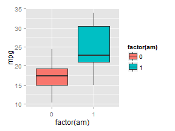
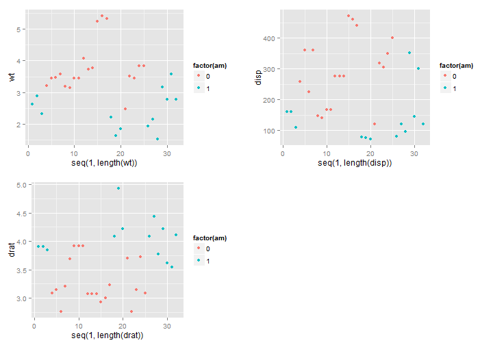

# Summary


        In this document We'll investigating the relation between fuel consumption(mpg) and tranmission (automatic or manual). <br/>
        
        
        The result show that we can conclude between automatic and manual which one is better because weight plays an importance role. The difference of MPG between automatic and manual transmission is not constant and depends on weight. </br>


# Exploratory analysis

## The Data

The data was extracted from the 1974 Motor Trend US magazine, and comprises fuel consumption and 10 aspects of automobile design and performance for 32 automobiles (1973-74 models). </br>


```r
head(mtcars,2)
```

```
##               mpg cyl disp  hp drat    wt  qsec vs am gear carb
## Mazda RX4      21   6  160 110  3.9 2.620 16.46  0  1    4    4
## Mazda RX4 Wag  21   6  160 110  3.9 2.875 17.02  0  1    4    4
```


_mpg_ (Miles/(US) gallon) is our output variable. The _am_(transmission 0=automatic, 1= manual) is our predictor. We'll investigating the relation of _mpg_ and _am_. </br>
The _Mpg_ is a continous variable and _am_ is a dummy variable which takes 0 for automatic and 1 for manual. </br>

We will check if we should include other variables in the database into our model. We do not want inflate our model nor exclude useful variable. Among theses variables, _cyl_, _vs_, _gear_, _carb_ are dummies variables, and _disp_, _hp_, _drat_, _wt_, _qsec_ are continous variable.</br>

The dummies variables wil be change to factor when fitting the model

## Am and mpg
We can observe that there are group effect on mpg. We can suppose that the manual transmission (am=1) increasing fuel consumption. _see plot1_


## am and other independent variables:

I made point plots for other variable and color it by am. I want to check the relation between automatic/ ùanual transmission with other variables. Nevertheless, I just show useful plots._See plot2_


We can observe that the values of _wt_, _disp_, _drat_ are related to _am_. When fitting the model, it suggest that we should create a variable of interaction between _am_ and these variables.

 


 

# Choosing the right model


```
##              Estimate Std. Error   t value     Pr(>|t|)
## (Intercept) 17.147368   1.124603 15.247492 1.133983e-15
## factor(am)1  7.244939   1.764422  4.106127 2.850207e-04
```

We will adding variable into our model one by one and use `{r anova}` to check if it worths to adding this variable. The order is defined by the absolute value of the correlation of mpg with the variable. I'll put the variable with strongest value first.


```r
sort(abs(cor(mtcars)[,1]), decreasing=TRUE)
```

```
##       mpg        wt       cyl      disp        hp      drat        vs 
## 1.0000000 0.8676594 0.8521620 0.8475514 0.7761684 0.6811719 0.6640389 
##        am      carb      gear      qsec 
## 0.5998324 0.5509251 0.4802848 0.4186840
```

The criteria of choosing the model passing the `{r anova}` test (p value <5%). Then I also look at the ajusted R^2 value. I'll show just the useful models that passed the `{r anova}` test.


the p_value of these model are inferior than 5% thus passed the `{r anova}` test.
There are three models that passed the tests. Looking at their adjusted $R^2$, the int9 model has highest value.

```r
anova(fit, int1, int2, int9)
```

```
## Analysis of Variance Table
## 
## Model 1: mpg ~ factor(am)
## Model 2: mpg ~ factor(am) + wt + wt * factor(am)
## Model 3: mpg ~ factor(am) + wt + wt * factor(am) + factor(cyl)
## Model 4: mpg ~ factor(am) + wt + wt * factor(am) + factor(cyl) + qsec
##   Res.Df    RSS Df Sum of Sq       F    Pr(>F)    
## 1     30 720.90                                   
## 2     28 188.01  2    532.89 57.1536 4.727e-10 ***
## 3     26 137.99  2     50.02  5.3643   0.01152 *  
## 4     25 116.55  1     21.44  4.5999   0.04188 *  
## ---
## Signif. codes:  0 '***' 0.001 '**' 0.01 '*' 0.05 '.' 0.1 ' ' 1
```

```r
rbind(summary(fit)$adj.r.squared, summary(int1)$adj.r.squared, summary(int2)$adj.r.squared, summary(int9)$adj.r.squared)
```

```
##           [,1]
## [1,] 0.3384589
## [2,] 0.8151486
## [3,] 0.8538884
## [4,] 0.8716582
```

I choose int9 to interpret the effect of am on mpg. We can notice than the p_value of am and the interaction term am*wt are lower than 5% thus their coefficients are different from 0


```
##                  Estimate Std. Error    t value    Pr(>|t|)
## (Intercept)    10.7883482  9.2441804  1.1670422 0.254204858
## factor(am)1    13.5062777  3.9362244  3.4312773 0.002096746
## wt             -2.9148171  0.8267962 -3.5254360 0.001656303
## factor(cyl)6   -0.5447303  1.6239960 -0.3354259 0.740102358
## factor(cyl)8   -0.3643287  2.5214242 -0.1444932 0.886269543
## qsec            0.9728476  0.4535978  2.1447362 0.041881821
## factor(am)1:wt -3.9741065  1.3104167 -3.0327044 0.005581111
```

#Interpretting the effect

## The effect of am on mpg

Our model: $mpg_i= \beta_0 + \beta_1* am_{i1}  + \beta_2* cyl6_{i2} + \beta_3* cyl8_{i3}+ \beta_4* qsec_{i4} + \beta_5* wt*am_{i5}+ \beta_6*wt_{i6}   + \epsilon_i$

$am_{i1}$ is 1 for manual and 0 automatic transmission.
$wt*am_{i5}$ is the interaction term between weight and transmission </br>
$beta_1$: when all else are constant, in comparison with am transmission, the manual transmission's effect on mpg is higher than the am's effect by $beta_1=$ 13.506 miles/(US) gallon. </br>
$beta_5$: with an increase by 1 unit of weight, the effect of manual transmission on mpg in comparison with the am transmission is reduced by $beta_5=$ -3.974. </br>

So the manual transmission did increase the mpg but its effect reduces when weight increases. 
"Is an automatic or manual transmission better for MPG?" The answer is its depend on weight. For light weight, the automatic is better but for higher weight, the manual is better. 

## Quantify the MPG difference between automatic and manual transmissions?

The difference of the expected of value of mpg between automatic and manual transmission  holding all other variables constant is: </br>
$E[mpg_i|am_i=1, all-else-constant]- E[mpg_i|am_i=0, all-else-constant]=\beta_1+\beta_5*wt_i$
This difference depends on weight and not constant.

# Conclusion
We can not say the automatic or manual is better because its effect depends on weight. The difference of mpg is not constant and also depends on weight. In this regression, we can not conlude any causal relation between transmission and mpg. Perhaps, it is weight that determine the kind of transmission and weight has most important influence on mpg.  


